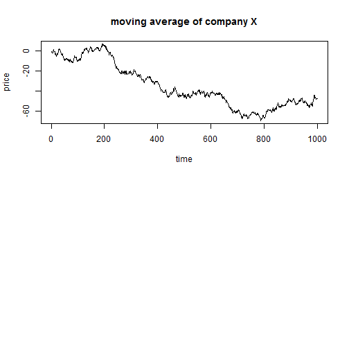
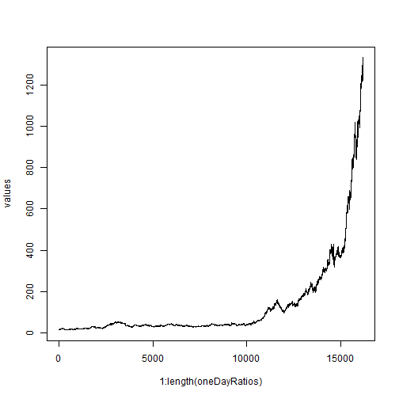
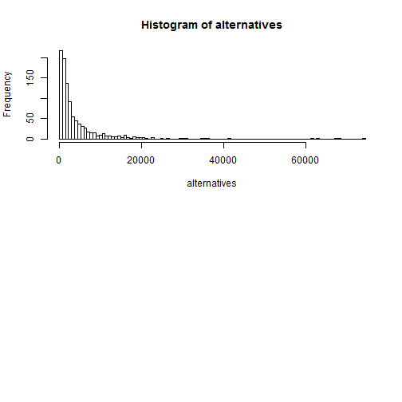

# Concept - Creat a stock price chart with a Random Walk.

It has been argued that there is a lot of randomness in the stock market.  For example, a random graph that looks similar to a Wall Street chart can be made in R with one line:

```r
par(mfrow = c(2, 1))
plot(cumsum(rnorm(1000)), type = "l", main = "moving average of company X", 
    ylab = "price", xlab = "time")
```

 


---  

# A random walk, using historical changes for the probability distribution

Of course, a cumulative sum of a normal distribution seems like a poor substitute for a true stock market graph.  Let's use historical data from the S & P 500 index.

Here is the method:

<ol>
<li>Download <a href="http://finance.yahoo.com/q/hp?s=%5EGSPC&a=00&b=1&c=1950&d=04&e=22&f=2014&g=d">historical data</a> of <a href="http://en.wikipedia.org/wiki/S_%26_P_500">the S &amp; P 500</a> going back to January of 1950.  The data set used in this example goes from Jan. 3, 1950 (when it closed at 16.66) to April 11, 2014 (when it closed at 1815.69).</li>
<li>  View <a href="http://finance.yahoo.com/echarts?s=%5EGSPC+Interactive#symbol=%5EGSPC;range=my">the graph of the historical data</a> for reference</li>
<li>  Determine the percentage change for each day.</li>
<li>  Randomly sample from those differences.</li>
<li>  Create a graph (shown on next slide)</li>
<li>  Randomly sample many times, as if you were running alternative histories of what might have been, and look at the distribution of the results (on page 5).
</ol>

---

# A random graph, created by random sampling from the historical daily changes of the S & P 500
 

```
## [1] "ending value: 1331.41060298037"
```

---

# Monte Carlo Simulation of many "alternative histories"

```r
alternatives <- doSNPReturnSimulation(numRuns = 1000, initial = 16.66)
summary(alternatives)
```

```
##    Min. 1st Qu.  Median    Mean 3rd Qu.    Max. 
##      24     880    1950    4180    4660   74600
```

Note how the median compares to the actual final value of 1815.69.  Below is the histogram of the results.  Note the distribution's long tail.

```r
par(mfrow = c(2, 1))
hist(alternatives, breaks = seq(0, max(alternatives), by = max(alternatives)/100))
```

 


